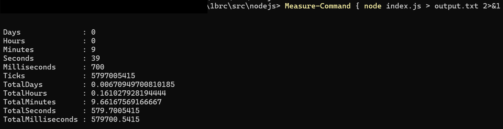

# All the tries and observations in series

Tried using readFile and readFileSync , first of all , reading whole 13GB at once seems like a bad idea. Secondly, there is a limit of 2GB on both two functions. So cannot use that

### Step 1 : Read Stream

- Using `fs.readStream` instead to process the data
- Not processing results file yet. Just seeing how long it takes for it to just read and calculate the min , max and average
- Using `forEach` instead of basic for , because i wanna see how long of difference it will make when i replace it with basic for loop
- Also I've no idea all these professional people calculating their timings , Im just doing some basic `Measure-Command { node index.js > output.txt 2>&1 }` because that seems simpler and good enough.
- For now `.on('data')` gives about 4751 rows per chunk , i think there should be some way to increase it. And for per chunk , i was getting around 2.7
- Using object instead of map, I read somewhere it's better to read map instead of objects, i've no idea how that works and never had a "BIG" use case , this looks like one. So excited to see the difference it makes
- The task manager while the process is running shows only ~250MB on NodeJs Runtime , which is a little weird to me or it's just bunch of skill issues

#### Results of `Measure-Command { node index.js > output.txt 2>&1 }`


(without writing output)

#### Processing data calculated using `performance.now`

```js
{
  chunksCount: 210501,
  averageChunkReadTime: 2.6656237428088345,
  averageRowsPerChunk: 4751.571256193383
}
```

### Step 2 : Average Calculation Method

- Updating average on every iteration seems like bad idea. so i add sum to the object and calculating averages now in `on("end")` , even though the overall program took more time , i think it's still fine , here we are iterating over all the data and adding one field to each object , which can be emitted at the time of writing to results file
- Removed the `processingData` object , seemed bit unnecessary
- Also the windows `Measure-Command` was good , but it was non responsive for straight 10 mins+ which makes me judge my life, so i just calculate overall time by using `performance.now` instead , where i also added percentage log in `.on("data")` -> `console.log(`${processRows / 10000000}%`);`. Now i can stare as random 8 digit logs for 12 mins straight.
- Total time after these changes = 763100.61ms, which is 12 minutes,43 seconds, and 101 milliseconds. Amazing!!

## References

1. A basic loops benchmark i ran on jsben.ch -> https://jsben.ch/Fw159
